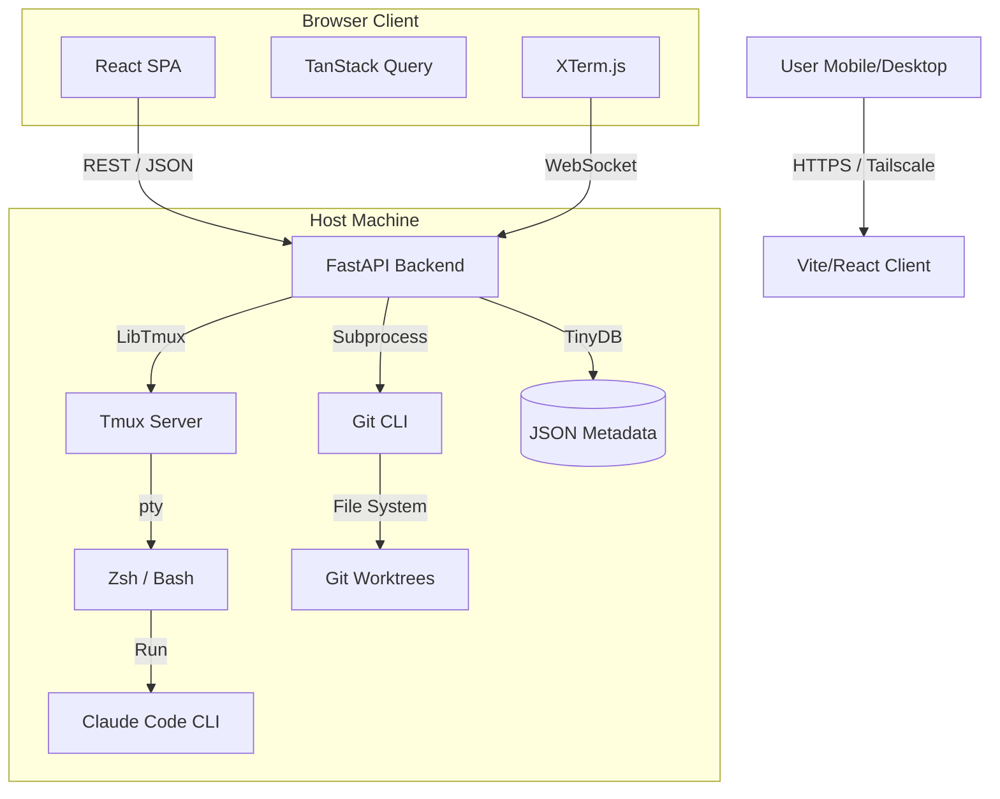

# Architecture

The system follows a decoupled client-server model. The backend serves a JSON API and WebSockets; the frontend is a React SPA.

## High-Level Overview

## Tech Stack

| Component | Choice | Rationale |
|-----------|--------|-----------|
| Language | Python 3.11+ | Required for libtmux and subprocess management |
| Web Framework | FastAPI | Async support for WebSockets, auto Swagger docs |
| Frontend | React + Vite | Robust ecosystem, PWA support |
| State | TanStack Query | Server state caching, polling for diffs |
| Terminal | xterm.js | Industry standard terminal emulator |
| Styling | Tailwind CSS | Utility-first CSS for responsive layouts |
| Persistence | TinyDB | Serverless, portable, human-readable JSON |

## Data Flow

### Terminal Stream (WebSocket)

1. Client opens WebSocket to `ws://host/api/session/{name}/stream`
2. Backend spawns a PTY attached to the tmux pane
3. Backend streams raw bytes to client via `xterm.write()`
4. Client keystrokes sent back via `pane.send_keys()`

### Live Diffs (Polling)

1. TanStack Query polls `/api/sessions/{name}/git/diff` every few seconds
2. Backend runs `git diff HEAD` in the session's working directory
3. Returns structured JSON with files, stats, and raw diff output
4. Frontend renders color-coded diff view

### Worktree Management

1. User configures a repo search directory in settings
2. App scans for directories containing `.git`
3. On session creation with worktree mode:
    - Validates the parent repo exists
    - Runs `git worktree add` with the specified branch
    - Creates tmux session in the worktree directory
    - Stores session metadata in TinyDB
